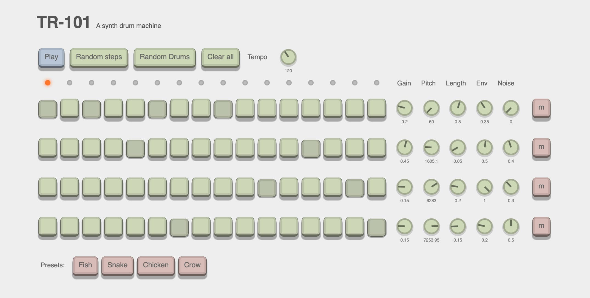

# TR-101

[](https://amilajack.github.io/drum-machine/)

A Drum machine. Made with [Vue](https://vuejs.org) and the [web audio api](https://developer.mozilla.org/en-US/docs/Web/API/Web_Audio_API).

## Live Demo

See the [live demo here](https://amilajack.github.io/drum-machine/)

## Build Setup

``` bash
# install dependencies
yarn
# serve with hot reload at localhost:8080
yarn dev
# build for production with minification
yarn build
# build for production and view the bundle analyzer report
yarn build --report
```

## Planned Additions

- [ ] Mobile support (touch interface for knobs)
- [ ] Make tempo changes and pauses/plays restart from the same place (probably with some accumulator parameter)
- [ ] Accent / velocity editing
- [ ] Audio to keep running in the background (even when `requstAnimationFrame` isn't being called)
- [ ] Different waveforms
- [ ] Master volume
- [ ] Filters (HP/LP)
- [ ] Keyboard shortcuts
- [ ] Shareable presets
- [ ] Effects (distortion, delay, reverb)
- [ ] Animated knob changes for preset loading / randomisation
- [ ] Sampler capabilities
- [ ] Knob configurable color and size
